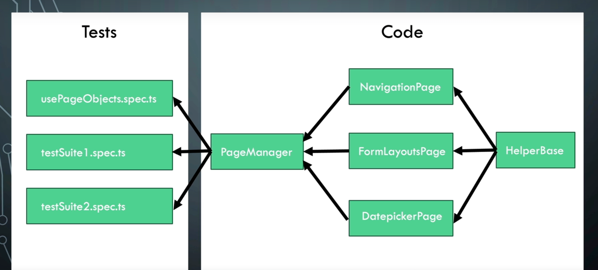
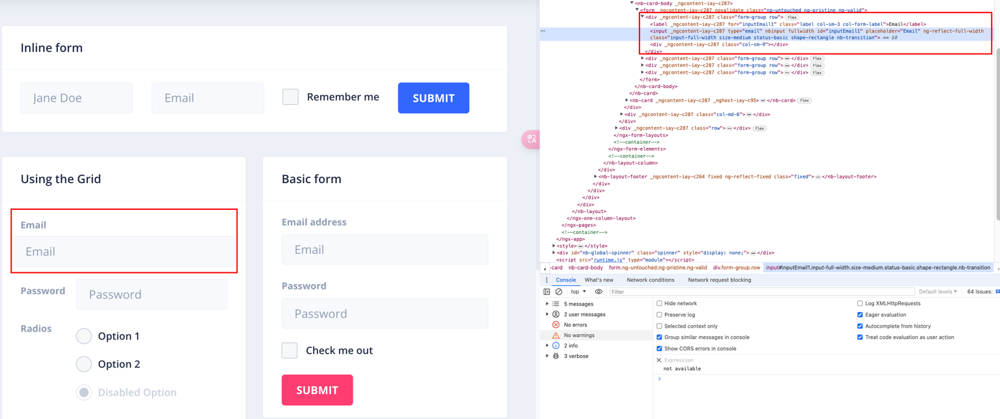
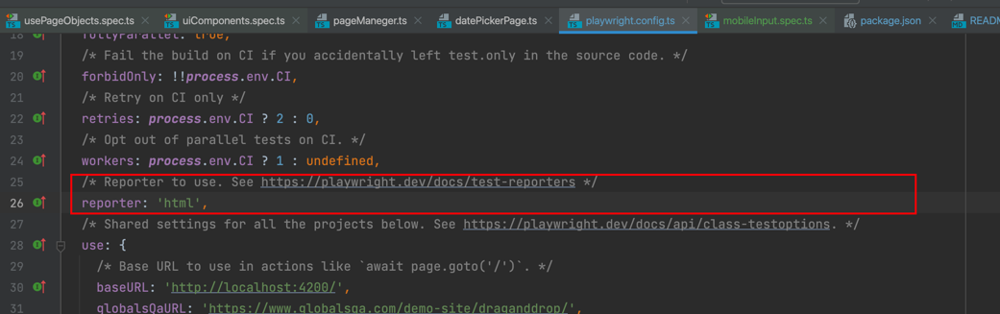
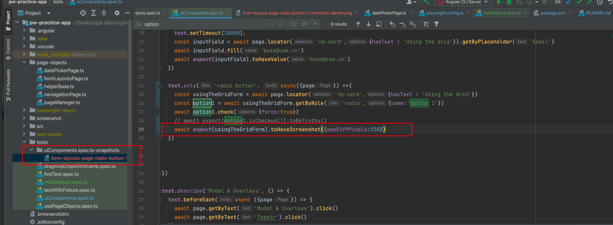

### Ngx-Admin Angular 14 application from akveo.com

https://github.com/akveo/ngx-admin

# Framework Architecture

# how to record the test
```shell
npx playwright codegen
```
# how to start an e2e automation testing 
## 1. playwright command
```shell
cd cd pw-practice-app
npm start
npx playwright test --ui                     //in UI mode
npm run pageObejcts-chrome                   //in chrome web browser

```
## 2. an easy model of test.spec.ts
```ts
import {test} from '@playwright/test'


test.beforeEach(async ({page})=> {
await page.goto('http://localhost:62127/')
})

test.describe('suite1',()=>{
test.beforeEach(async ({page})=> {
await page.getByText('Forms').click()
})
test('the first test',async ({page}) =>{
await page.getByText('Form Layouts').click()
})

test('navigate to datapicker page',async ({page}) =>{
await page.getByText('Datepicker').click()
})
})

test.describe('suite2',()=>{
test.beforeEach(async ({page})=> {
await page.getByText('Charts').click()
})
test('the first test1',async ({page}) =>{
await page.getByText('Form Layouts').click()
})

test('navigate to datapicker page2',async ({page}) =>{
await page.getByText('Datepicker').click()
})
})
```
## 3. how to locate the html element

```ts
test('Locator systax rules', async({page}) => {
  //by tag name
  page.locator('input')
  //by id
  page.locator('inputEmail1')
  //by class value
  page.locator('.shape-rectangle')
  //by attribute
  page.locator('[placeholder="Email"]')
  //by class value(full)
  page.locator('[class="input-full-width size-medium status-basic shape-rectangle nb-transition"]')
  //combine different selectors
  page.locator('input[placeholder="Email"][nbinput]')
  //by xpath (not recommended)
  page.locator('//*[@id="inputEmail1"]')
  //by partial test match
  page.locator(':text("Using")')
  //by exact text match
  page.locator(':text-is("Using the Grid")')
})
```
best practice--user facing locator
```ts
test('user facing locator',async({page}) =>{
  page.getByRole('textbox')
  page.getByLabel('Email')
  page.getByPlaceholder('Email')
  page.getByText('Using the Grid')
  page.getByTitle('IoT Dashboard')
})

```
how to locate in multiple same locators
```ts
test('locate in multiple same locators',async({page}) =>{
  page.getByRole('button', {name:'Sign in'}).first()
  page.getByRole('button', {name:'Sign in'}).nth(3)
})
```
how to locate child locators
```ts
test('locate child locators',async({page}) =>{
  page.locator('nb-card').getByRole('button', {name:'Sign in'})
  page.locator('nb-card').locator('nb-radio')
})
```
how to locate parent locators
```ts

```
#  advanced
## 1.install data generator -- faker
Reference: https://www.npmjs.com/package/@faker-js/faker
```shell
npm install @faker-js/faker --save-dev --force

import {faker} from '@faker-js/faker'
test('parameterize methods', async ({page})=>{
  const pm = new PageManeger(page)
  const randomFullName = faker.person.fullName()
  const randomEmail = `${randomFullName.replace(' ','')}${faker.number.int(1000)}@tester.com`
  await pm.naviagteTo().formLayoutPage()
  await pm.onFormLayouts().submitInlineFrom(randomFullName,randomEmail,true)

})
```

## retry when test are failed
Reference: https://playwright.dev/docs/test-retries
### 1. config in playwright.config.ts
```shell
//fail then retry 1 time
retries: process.env.CI ? 2 : 1
```
### 2. add in the test file [uiComponents.spec.ts]
```ts
test.describe.only('form layouts page', () =>{
  test.describe.configure({retries:2})
  test.beforeEach(async ({page}) =>{
    await page.getByText('Forms').click()
    await page.getByText('Form Layouts').click()
  })

  test('input field', async({page},testInfo) =>{
    if(testInfo.retry){
      console.log("the second time to exacute")
    }
    test.setTimeout(10000);
    const inputField = await page.locator('nb-card',{hasText : 'Using the Grid'}).getByPlaceholder('Email')
    await inputField.fill('boss@com.cn')
    await expect(inputField).toHaveValue('boss@com1.cn')
  })

  test('radio button', async({page}) =>{
    const option1 = await page.locator('nb-card',{hasText : 'Using the Grid'}).getByRole('radio',{name:'Option 1'})
    await option1.check({force:true})
    await expect(option1.isChecked()).toBeTruthy()
  })
```

### 3. parallel the test
Reference: https://playwright.dev/docs/test-parallel

### 4. screenshot and videos
screenshot Reference: https://playwright.dev/docs/screenshots
add in the test file
```ts
await page.screenshot({path: 'screenshot/formLayoutPage.png'})
//screenshot part of the page
await page.locator('nb-card',{hasText : 'Inline form'}).screenshot({path: 'screenshot/inlineFormPage.png'})
//save the binary data of screenshot
const buffer = page.screenshot()
console.log(buffer)
```
video Reference: https://playwright.dev/docs/videos

### 5. envoriment parameter manager
```shell
npm i dotenv --save-dev --force
```
create a file: .env
quote the parameter in the test file
```ts
await pm.onFormLayouts().submitUsingTheGridFrom(process.env.Email,process.env.Password,'Option 1')
```

### 6.test configuration and test use options
test configuration reference: https://playwright.dev/docs/test-configuration
test use options reference: https://playwright.dev/docs/test-use-options

### 7.fixture
reference: https://playwright.dev/docs/test-fixtures

### 8.use tag to run specific test
reference: https://playwright.dev/docs/test-annotations

### 9.mobile device emulator
emulate devices or viewpoint
```shell
npx playwright codegen --device="iPhone 13 Pro" http://localhost:4200/
npx playwright codegen --viewport-size=800,600 playwright.dev
```
run mobile emulator test
```shell
npm run pageObejcts-mobile
```

### 10.reporter

also we can generate visual test result reporter with allure reporter
https://allurereport.org/docs/install-for-macos/
https://allurereport.org/docs/playwright-configuration/

### 11. using the screenshot to visual test


### 12. execute playwright test in docker
tutorial:
https://playwright.dev/docs/codegen
https://testgrid.io/blog/playwright-testing-with-docker/

### 13. execute playwright test in github action and argos ci
the most github CLI: https://www.bondaracademy.com/blog/most-poular-git-commands-for-testers
CI GitHub Actions tutorial: https://playwright.dev/docs/ci-intro
argos ci with playwright: https://argos-ci.com/docs/quickstart/playwright


